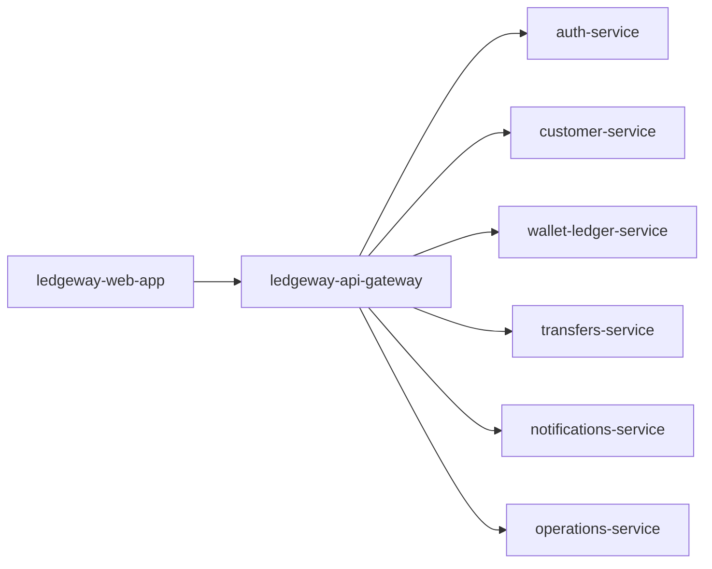

# ledgeway-api-gateway

`ledgeway-api-gateway` is the single public backend entrypoint for Ledgeway. The web app talks to this service, and this service fans requests out to the domain services.

The same gateway code can sit behind the full platform runtime or the code-only bootstrap workspace.

## Service Role

The gateway is intentionally thin. It does not own business state. Its job is to provide one stable public API surface and enforce the platform’s access rules before delegating work to the domain services.

## Where It Sits



## Responsibilities

- expose a single backend URL to the frontend
- proxy public auth routes
- authenticate protected requests through token introspection
- enforce role checks for admin and ops routes
- forward authenticated identity to downstream services through internal headers
- expose a dependency-health view for the whole app tier

## What The Gateway Does Not Do

- it does not store domain state
- it does not execute KYC, money movement, or notification business logic itself
- it does not replace domain authorization inside every service

The gateway is the front door, not the product brain.

## Route Surface

| Domain | Routes exposed |
| --- | --- |
| Health | `/`, `/health`, `/ready`, `/info`, `/v1/health/dependencies` |
| Auth | `/v1/auth/register`, `/v1/auth/login`, `/v1/auth/introspect` |
| Customer | `/v1/profiles/:userId`, `/v1/kyc/check`, `/v1/kyc/:userId/status`, `/v1/kyc/:userId/decision`, `/v1/beneficiaries`, `/v1/beneficiaries/:userId` |
| Wallet and ledger | `/v1/wallets`, `/v1/wallets/:walletId/topup`, `/v1/wallets/:walletId/balance`, `/v1/pots*`, `/v1/cards*`, `/v1/payments/internal`, `/v1/ledger/entries`, `/v1/statements/:walletId`, `/v1/statements/:walletId/export` |
| Quotes and transfers | `/v1/quotes*`, `/v1/rates*`, `/v1/transfers*`, `/v1/transfer-schedules*` |
| Notifications | `/v1/notifications/send`, `/v1/notifications`, `/v1/notifications/:notificationId`, `/v1/notifications/:notificationId/read` |
| Operations | `/v1/audit/events`, `/v1/reconciliation/runs*`, `/v1/feature-flags` |

## Request Lifecycle

### Public auth routes

1. The gateway receives `register`, `login`, or `introspect`.
2. It forwards the request directly to `auth-service`.
3. It returns the upstream response as-is.

### Protected routes

1. The gateway receives a request with `Authorization: Bearer ...`.
2. It calls `auth-service /v1/auth/introspect`.
3. If the token is inactive, the gateway returns `401`.
4. If the route requires `ops` or `admin` and the role does not match, the gateway returns `403`.
5. Otherwise it forwards the request to the target service with:
   - `x-auth-user-id`
   - `x-auth-user-role`
   - `x-auth-user-email`

The proxy layer also preserves non-JSON response types now, so statement exports can pass through as `text/csv` or `application/pdf` instead of being flattened into plain text.

## Dependency View

`GET /v1/health/dependencies` checks the health endpoints of:

- `auth-service`
- `customer-service`
- `transfers-service`
- `wallet-ledger-service`
- `operations-service`
- `notifications-service`

This makes the gateway a convenient platform-level health probe for demos and scripts.

## State And Dependencies

| Concern | Behavior |
| --- | --- |
| Domain state | none, stateless |
| Auth source | `auth-service` introspection |
| Timeout policy | `UPSTREAM_TIMEOUT_MS` |
| Runtime dependencies | all six domain services |

## Runtime Modes

| Mode | Upstream targets |
| --- | --- |
| Full platform | container service URLs from Compose |
| Bootstrap workspace | localhost process URLs from `ledgeway-bootstrap/scripts/run-dev.sh` |

The public route surface is intentionally the same in both modes.

## Important Environment Variables

| Variable | Purpose |
| --- | --- |
| `PORT` | listen port, default `8080` |
| `AUTH_SERVICE_URL` | token authority and auth proxy target |
| `CUSTOMER_SERVICE_URL` | profile, KYC, beneficiary target |
| `LEDGER_SERVICE_URL` | wallets, pots, cards, ledger target |
| `TRANSFER_SERVICE_URL` | quote, rate, transfer target |
| `NOTIFICATIONS_SERVICE_URL` | notification target |
| `OPERATIONS_SERVICE_URL` | audit and reconciliation target |
| `UPSTREAM_TIMEOUT_MS` | fetch timeout for upstream calls |

## How It Ties Back To The Platform

The gateway is the point where several teaching concerns meet:

- API consolidation
- auth enforcement
- service discovery through env vars
- route ownership
- dependency health inspection

You can start from this service to understand how a frontend-facing API boundary is assembled from multiple backend services.

## Local Run

```bash
npm install
cp .env.example .env
npm run dev
```

Useful endpoints:

- `http://localhost:8080/health`
- `http://localhost:8080/v1/health/dependencies`

## Read Next

- [Ledgeway Bootstrap](https://github.com/CloudPros-Org/ledgeway-bootstrap)
- [ledgeway-auth-service](https://github.com/CloudPros-Org/ledgeway-auth-service)
- [ledgeway-contracts](https://github.com/CloudPros-Org/ledgeway-contracts)
