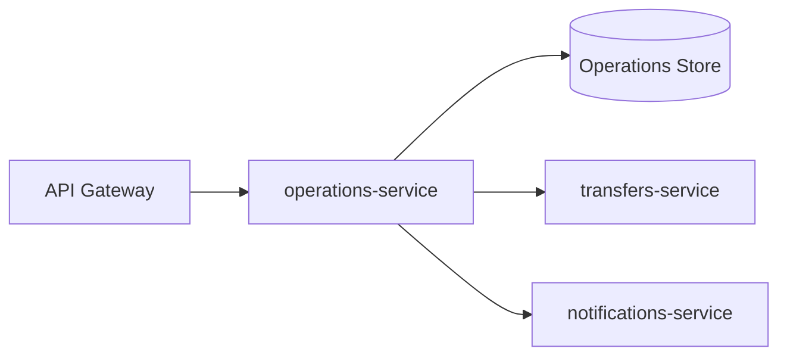

# ledgeway-audit-service

`ledgeway-audit-service` is the operations domain in Ledgeway. In runtime and product terms it is exposed as `operations-service`.

The same operations-service code can run in the full platform runtime or the code-only bootstrap workspace.

## Service Role

This service owns the administrative and integrity-check side of the platform:

- audit event storage
- reconciliation run storage
- runtime feature-flag storage
- stale-state inspection across transfers and notifications

It is the service that answers “is the platform internally consistent?”.

## Where It Sits



## Responsibilities

- create audit events
- list audit events
- create reconciliation runs
- list feature flags
- update feature flags
- detect stale transfers
- detect stale queued notifications
- persist reconciliation results for later inspection

## Public Endpoints

| Route | Purpose |
| --- | --- |
| `POST /v1/audit/events` | create an audit event |
| `GET /v1/audit/events` | list audit events |
| `POST /v1/reconciliation/runs` | run an integrity check |
| `GET /v1/reconciliation/runs/:runId` | fetch one reconciliation run |
| `GET /v1/feature-flags` | list runtime feature flags |
| `POST /v1/feature-flags` | create or update a runtime feature flag |

## How Reconciliation Works

1. Load transfers from `transfers-service /internal/transfers`.
2. Load notifications from `notifications-service /internal/notifications`.
3. Compare each record against staleness rules.
4. Build a discrepancy list.
5. Persist a reconciliation run with counts, details, and final status.

Current discrepancy examples:

- transfer service unavailable
- notifications service unavailable
- stale processing transfer
- stale queued or pending notification

## State Model

| Record | Purpose |
| --- | --- |
| Audit event | who did what, to which entity, with what metadata |
| Reconciliation run | summary of one integrity-check execution and any findings |
| Feature flag | runtime capability toggle used by the product and ops UI |

## Runtime Modes

| Mode | Storage |
| --- | --- |
| Full platform | Postgres |
| Bootstrap workspace | in-memory |

## Important Environment Variables

| Variable | Purpose |
| --- | --- |
| `PORT` | listen port, default `4120` |
| `TRANSFER_SERVICE_URL` | internal transfer read target |
| `NOTIFICATIONS_SERVICE_URL` | internal notification read target |
| `STALE_TRANSFER_MINUTES` | age threshold for stale processing transfers |
| `STALE_NOTIFICATION_MINUTES` | age threshold for stale queued notifications |
| `DATABASE_URL` or `OPERATIONS_DATABASE_URL` | persistent store |

## How It Ties Back To The Platform

This service is what turns the platform from “a set of working APIs” into “a system that can inspect itself”.

It is the clearest place to teach:

- reconciliation thinking
- internal service-to-service inspection
- administrative visibility
- basic control-plane style behavior inside an application platform

The feature-flag endpoints also make it the current home for lightweight runtime control-plane behavior.

## Local Run

```bash
npm install
cp .env.example .env
npm run dev
```

Useful endpoint:

- `http://localhost:4120/health`

## Read Next

- [Ledgeway Bootstrap](https://github.com/CloudPros-Org/ledgeway-bootstrap)
- [ledgeway-transfer-orchestrator-service](https://github.com/CloudPros-Org/ledgeway-transfer-orchestrator-service)
- [ledgeway-notifications-service](https://github.com/CloudPros-Org/ledgeway-notifications-service)
