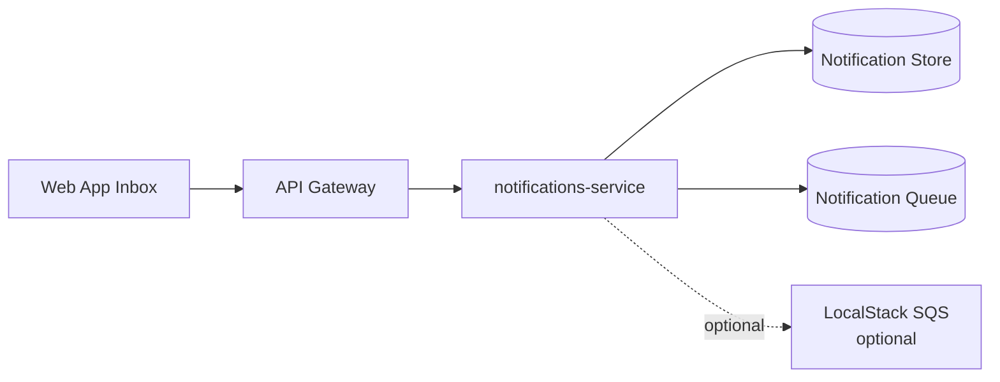
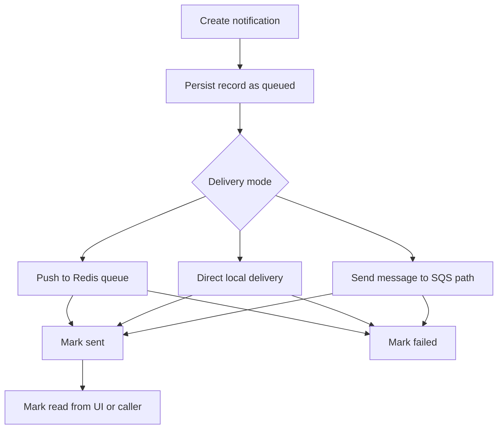

# ledgeway-notifications-service

`ledgeway-notifications-service` is the messaging and in-app notification record system for Ledgeway.

The same notifications code can run in the full platform runtime or the code-only bootstrap workspace.

## Service Role

This service owns notification records and delivery state. It is not only a backend message queue. It now also backs a visible frontend feature: the in-app inbox and unread notification count in the web app.

## Where It Sits



## Responsibilities

- create notification records
- dispatch notifications in the configured mode
- list notifications for a user
- fetch individual notifications
- mark notifications as read
- maintain delivery metadata such as status, sent time, failed time, and queue ids

## Public Endpoints

| Route | Purpose |
| --- | --- |
| `POST /v1/notifications/send` | create and dispatch a notification |
| `GET /v1/notifications/:notificationId` | fetch one notification |
| `POST /v1/notifications/:notificationId/read` | mark one notification as read |
| `GET /v1/notifications` | list notifications visible to the caller |

## Notification Lifecycle



## Delivery Modes

| Mode | Meaning |
| --- | --- |
| `redis` | queue-backed local delivery path, default in the full platform |
| `memory` | direct local dispatch path, default in the bootstrap workspace |
| `sqs` | optional AWS-like path through LocalStack or a real SQS endpoint |

## State Model

Each notification record can carry:

- `notificationId`
- `userId`
- `channel`
- `template`
- `payload`
- `status`
- `deliveryMode`
- `queueMessageId`
- `sentAt`
- `failedAt`
- `readAt`
- `error`

`readAt` is what makes the in-app inbox genuinely stateful instead of just a log table.

## How It Works

### Send

1. Validate payload.
2. Enforce caller access to the target user.
3. Persist the notification record with initial `queued` state.
4. Dispatch according to configured delivery mode.
5. Update the record to `sent` or `failed`.

### Read state

1. The web app fetches the user’s notifications.
2. Unread in-app items are those without `readAt`.
3. The inbox can mark a record read through `POST /v1/notifications/:notificationId/read`.
4. That read marker persists in the full runtime and survives restart.

## Runtime Modes

| Mode | Store | Delivery |
| --- | --- | --- |
| Full platform | Postgres | Redis-backed queue by default |
| Bootstrap workspace | in-memory | memory delivery by default |

## Important Environment Variables

| Variable | Purpose |
| --- | --- |
| `PORT` | listen port, default `4100` |
| `NOTIFICATIONS_DELIVERY_MODE` | `redis`, `memory`, or `sqs` |
| `DATABASE_URL` or `NOTIFICATIONS_DATABASE_URL` | persistent record store |
| `REDIS_URL` / `NOTIFICATIONS_QUEUE_REDIS_URL` | Redis queue connection |
| `NOTIFICATIONS_QUEUE_URL` | SQS queue URL |
| `AWS_ENDPOINT_URL_SQS` | SQS-compatible endpoint |

## How It Ties Back To The Platform

This service connects three layers of the platform:

- backend events and side effects
- queue infrastructure
- visible user experience in the browser

It is one of the clearest examples of how a “platform” capability becomes a user-facing product feature.

## Local Run

```bash
npm install
cp .env.example .env
npm run dev
```

Useful endpoint:

- `http://localhost:4100/health`

## Read Next

- [Ledgeway Bootstrap](https://github.com/CloudPros-Org/ledgeway-bootstrap)
- [ledgeway-web-app](https://github.com/CloudPros-Org/ledgeway-web-app)
- [ledgeway-transfer-orchestrator-service](https://github.com/CloudPros-Org/ledgeway-transfer-orchestrator-service)
