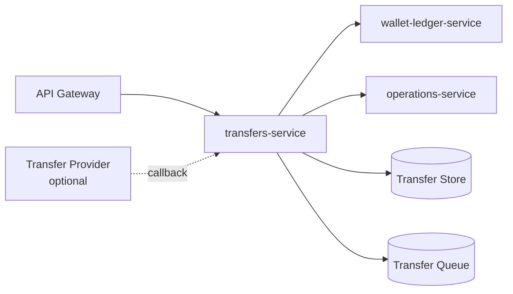
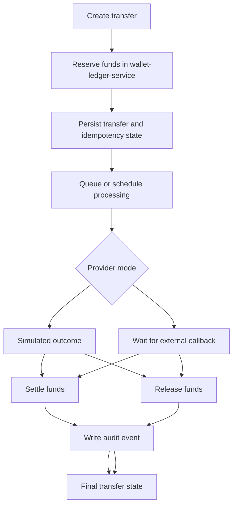

# ledgeway-transfer-orchestrator-service

`ledgeway-transfer-orchestrator-service` is the transfer domain in Ledgeway. In runtime and docs it is exposed as `transfers-service`.

The same transfer-service code can run in the full platform runtime or the code-only bootstrap workspace.

## Service Role

This service owns:

- quote creation
- FX rate state
- transfer creation and retrieval
- scheduled and recurring transfer plans
- idempotency handling
- transfer processing lifecycle
- transfer-provider callback handling

It is called an orchestrator because it coordinates ledger, notification, and operations side effects rather than owning wallet balances directly.

## Where It Sits



## Responsibilities

- create quotes from stored or refreshed FX rates
- list and fetch rates
- allow privileged callers to update or refresh rates
- create transfers
- create and cancel transfer schedules
- ensure idempotency
- reserve, release, and settle funds through the wallet-ledger service
- emit audit signals through the operations service
- process simulator or external-callback transfer outcomes

## Public Endpoints

| Route | Purpose |
| --- | --- |
| `POST /v1/quotes` | create a quote |
| `GET /v1/quotes/:quoteId` | fetch a quote |
| `GET /v1/rates` | list current rates |
| `POST /v1/rates` | manually set a rate as privileged caller |
| `POST /v1/rates/refresh` | refresh provider-managed rates |
| `GET /v1/transfers` | list transfers |
| `POST /v1/transfers` | create a transfer |
| `GET /v1/transfers/:transferId` | fetch one transfer |
| `POST /v1/transfers/:transferId/cancel` | cancel a still-cancellable transfer |
| `GET /v1/transfer-schedules` | list transfer schedules |
| `POST /v1/transfer-schedules` | create a one-time or recurring plan |
| `POST /v1/transfer-schedules/:scheduleId/cancel` | cancel an active schedule |
| `POST /internal/provider-callback` | receive provider outcome callback |

## Transfer Lifecycle



## How It Works

### Quotes

1. The caller submits source and destination currency plus amount.
2. The service loads the relevant FX rate.
3. It calculates fee, rate, and destination amount.
4. It returns a quote snapshot with expiry time.

### Transfer creation

1. Validate payload and caller access.
2. Check idempotency key rules.
3. Resolve rate and beneficiary context.
4. Reserve funds through `wallet-ledger-service`.
5. Persist the transfer in `processing` or related intermediate state.
6. Queue the transfer or submit it to an external processor path.

### Processing

Depending on configuration, processing can be:

- simulator mode, where the service itself decides the outcome
- external-callback mode, where the service waits for a real provider callback

### Scheduled transfers

1. The caller creates a plan with `once`, `daily`, `weekly`, or `monthly` cadence.
2. The service persists the plan and the next due time.
3. The worker picks up due plans and turns them into normal transfer submissions.
4. The plan is advanced, completed, or cancelled depending on cadence and occurrence limits.

### Finalization

- success settles the reserved amount
- failure or cancellation releases the reserved amount
- audit events are written to `operations-service`

## FX Rates

The service supports persisted rates plus provider refresh.

Current verified local default:

- provider mode: `frankfurter`
- refresh interval: configurable
- supported currencies: configured through env

This makes FX a real managed runtime concern instead of a hard-coded inline constant.

## Runtime Modes

| Mode | State store | Processing path |
| --- | --- | --- |
| Full platform | Postgres | Redis-backed queue |
| Bootstrap workspace | in-memory | in-process scheduling fallback |

## Important Environment Variables

| Variable | Purpose |
| --- | --- |
| `PORT` | listen port, default `4060` |
| `LEDGER_SERVICE_URL` | reserve, release, settle target |
| `OPERATIONS_SERVICE_URL` | audit target |
| `DATABASE_URL` or `TRANSFERS_DATABASE_URL` | persistent transfer state |
| `REDIS_URL` / `TRANSFER_QUEUE_REDIS_URL` | queue backend |
| `FX_PROVIDER_MODE` | choose FX refresh source |
| `FX_PROVIDER_BASE_URL` | FX provider endpoint |
| `TRANSFER_PROVIDER_MODE` | simulator or external callback mode |
| `TRANSFER_PROVIDER_SUBMIT_URL` | outbound processor submission URL |
| `TRANSFER_PROVIDER_CALLBACK_TOKEN` | callback auth token |

## How It Ties Back To The Platform

This service is where several platform concerns meet at once:

- currency conversion
- idempotency
- async processing
- money reservation and settlement
- audit trail generation
- optional third-party processor integration

It is the strongest example of cross-service orchestration in the workspace.

## Local Run

```bash
npm install
cp .env.example .env
npm run dev
```

Useful endpoint:

- `http://localhost:4060/health`

## Read Next

- [Ledgeway Bootstrap](https://github.com/CloudPros-Org/ledgeway-bootstrap)
- [ledgeway-wallet-ledger-service](https://github.com/CloudPros-Org/ledgeway-wallet-ledger-service)
- [ledgeway-audit-service](https://github.com/CloudPros-Org/ledgeway-audit-service)
