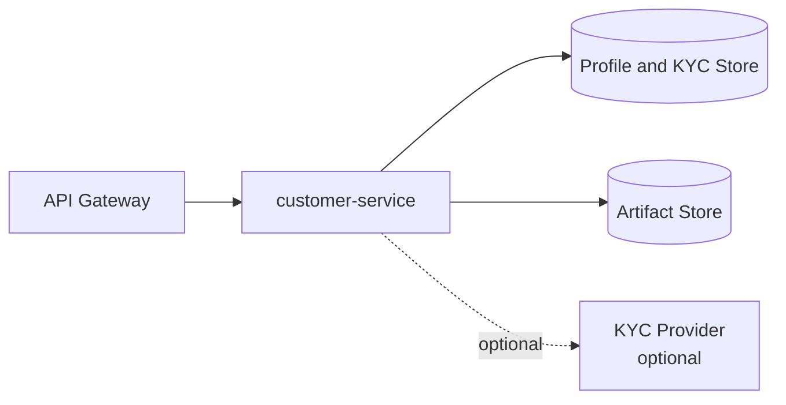

# ledgeway-user-profile-service

`ledgeway-user-profile-service` is the customer domain in Ledgeway. In runtime and docs it is exposed as `customer-service`.

The same customer-service code can run in the full platform runtime or the code-only bootstrap workspace.

## Service Role

This service owns customer-facing identity-adjacent data:

- profiles
- KYC state
- KYC review metadata
- beneficiary records

It is the system of record for “who the user is” after authentication but before money movement.

## Where It Sits



## Responsibilities

- create or return customer profiles
- start or evaluate KYC checks
- store KYC status, risk tier, and review details
- support manual `ops` or `admin` decisions
- store and list transfer beneficiaries

## Public Endpoints

| Route | Purpose |
| --- | --- |
| `GET /v1/profiles/:userId` | return or create the user profile |
| `POST /v1/kyc/check` | run KYC in the configured mode |
| `GET /v1/kyc/:userId/status` | get current KYC state |
| `POST /v1/kyc/:userId/decision` | override decision as `ops` or `admin` |
| `POST /v1/beneficiaries` | create a beneficiary |
| `GET /v1/beneficiaries/:userId` | list beneficiaries for a user |

## KYC Modes

| Mode | Meaning |
| --- | --- |
| `auto approve` | default teaching path, approves quickly and keeps flow simple |
| `policy` | internal rules decide approve, review, or reject |
| `provider-backed` | hosted external verification session with later refresh |

The default code-only teaching runtime currently auto-approves unless stricter configuration is enabled.

## How KYC Works

### Default teaching path

1. The user submits `country` and `documentType`.
2. The service records the attempt.
3. It stores evidence metadata.
4. It writes `approved` status with a risk tier appropriate to the teaching mode.

### Provider-backed path

1. The service starts a hosted verification session with the configured provider.
2. It stores provider name, provider reference, provider status, and hosted verification URL.
3. It writes KYC artifact metadata.
4. Later status reads can refresh the provider result and finalize the decision.

### Manual decision path

1. An `ops` or `admin` caller submits a decision.
2. The service updates KYC status and profile verification state.
3. Review metadata is persisted with reviewer and timestamp fields.

## Beneficiaries

Beneficiaries are the recipients used by `transfers-service`.

Each record stores:

- user id
- full name
- country
- payout method
- account number
- bank code
- currency

This is how the customer domain hands recipient data into the money-movement domain.

## State Model

| Record | Purpose |
| --- | --- |
| Profile | user-facing name, risk tier, verification status |
| KYC record | country, document type, status, reason, provider metadata, artifact metadata |
| Beneficiary | outgoing recipient details for transfers |

## Runtime Modes

| Mode | Persistence | Artifact storage |
| --- | --- | --- |
| Full platform | Postgres | MinIO or other S3-compatible target |
| Bootstrap workspace | in-memory | disabled by default |

## Important Environment Variables

| Variable | Purpose |
| --- | --- |
| `PORT` | listen port, default `4020` |
| `KYC_AUTO_APPROVE` | force the simple teaching path |
| `KYC_PROVIDER_MODE` | `policy` or provider-backed behavior |
| `KYC_PROVIDER_BASE_URL` | hosted provider base URL |
| `KYC_PROVIDER_API_KEY` / `KYC_PROVIDER_API_SECRET` | provider credentials |
| `KYC_PROVIDER_RETURN_URL` | hosted flow return URL |
| `KYC_ARTIFACT_STORAGE_REQUIRED` | require artifact persistence |
| `DATABASE_URL` or `CUSTOMER_DATABASE_URL` | persistent customer state |

## How It Ties Back To The Platform

This service is the bridge between auth and transfers:

- auth proves who the user is
- customer-service proves what the platform knows about that user
- transfers depends on beneficiary and KYC-adjacent state

It is also the clearest place to teach:

- policy-driven behavior
- optional provider integrations
- artifact storage
- admin override flows

## Local Run

```bash
npm install
cp .env.example .env
npm run dev
```

Useful endpoint:

- `http://localhost:4020/health`

## Read Next

- [Ledgeway Bootstrap](https://github.com/CloudPros-Org/ledgeway-bootstrap)
- [ledgeway-auth-service](https://github.com/CloudPros-Org/ledgeway-auth-service)
- [ledgeway-transfer-orchestrator-service](https://github.com/CloudPros-Org/ledgeway-transfer-orchestrator-service)
