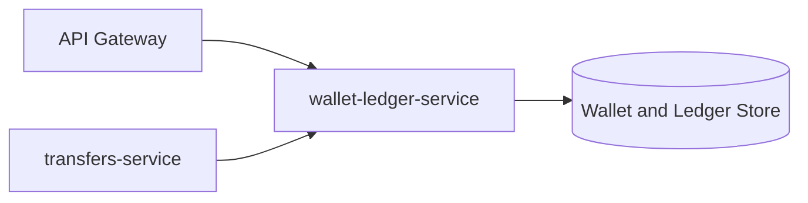

# ledgeway-wallet-ledger-service

`ledgeway-wallet-ledger-service` is the core account and balance system for Ledgeway. It owns wallets, balances, ledger entries, pots, cards, and the reserve/release/settle operations used by transfers.

The same wallet and ledger code can run in the full platform runtime or the code-only bootstrap workspace.

## Service Role

This is the money-state service. If the customer service answers “who is this user?”, this service answers “what money state do they currently have?”.

## Where It Sits



## Responsibilities

- create wallets
- return balances
- top up wallets
- create and move pots
- create and manage cards
- support internal wallet-to-wallet payments
- record ledger entries
- reserve, release, and settle funds for transfer processing
- build wallet statements
- export statements as `CSV`, `PDF`, or `JSON`

## Public Endpoints

| Route | Purpose |
| --- | --- |
| `POST /v1/wallets` | create a wallet |
| `GET /v1/wallets` | list wallets |
| `POST /v1/wallets/:walletId/topup` | add funds |
| `GET /v1/wallets/:walletId/balance` | view available and reserved balance |
| `POST /v1/pots` / `GET /v1/pots` | create and list pots |
| `POST /v1/pots/:potId/deposit` | move wallet funds into a pot |
| `POST /v1/pots/:potId/withdraw` | move pot funds back to wallet |
| `POST /v1/pots/transfer` | move funds between pots |
| `POST /v1/cards` / `GET /v1/cards` | create and list cards |
| `POST /v1/cards/:cardId/freeze` | freeze a card |
| `POST /v1/cards/:cardId/unfreeze` | unfreeze a card |
| `POST /v1/cards/:cardId/charge` | simulate a card spend |
| `POST /v1/payments/internal` / `GET /v1/payments/internal` | internal wallet transfer support |
| `POST /v1/ledger/reserve` | reserve transfer funds |
| `POST /v1/ledger/release` | release reserved funds |
| `POST /v1/ledger/settle` | settle reserved funds |
| `GET /v1/ledger/entries` | inspect ledger activity |
| `GET /v1/statements/:walletId` | build a statement for a date window |
| `GET /v1/statements/:walletId/export` | export that statement as `CSV`, `PDF`, or `JSON` |

## Core Money Model

### Wallets

Wallets track:

- `availableBalance`
- `reservedBalance`
- `currency`
- wallet identity and ownership

### Pots

Pots are internal goal-based money buckets tied to one wallet. They are the main “money separation” concept in the product.

### Cards

Cards are virtual spending instruments with:

- active or frozen state
- daily limit
- spent-today tracking

### Ledger entries

The ledger records activity types such as:

- `topup`
- `hold`
- `release`
- `settle`
- `card_charge`
- `pot_deposit`
- `pot_withdraw`
- `pot_transfer`
- `internal_payment`

### Statements and exports

Statements are derived from wallet-owned ledger entries inside a requested date window. The service calculates:

- transaction count
- money in
- money out
- reserve and release counts
- closing available balance
- closing reserved balance

Exports are then rendered from that statement shape as:

- `JSON` for structured downstream use
- `CSV` for spreadsheet workflows
- `PDF` for shareable human-readable statements

## How It Works

### Regular user flow

1. The gateway forwards an authenticated user request.
2. The service validates wallet ownership or privileged access.
3. The requested movement updates the relevant wallet or pot balances.
4. A ledger entry is created for traceability.

### Transfer coordination flow

1. `transfers-service` calls reserve.
2. `wallet-ledger-service` moves funds from available to reserved balance and writes a hold entry.
3. Later, transfers either:
   - call release to return funds
   - call settle to finalize the outflow

That reserve/release/settle contract is one of the most important service boundaries in the platform.

## Runtime Modes

| Mode | Storage |
| --- | --- |
| Full platform | transactional Postgres |
| Bootstrap workspace | in-memory maps and arrays |

## Important Environment Variables

| Variable | Purpose |
| --- | --- |
| `PORT` | listen port, default `4040` |
| `DATABASE_URL` or `WALLET_DATABASE_URL` | persistent money-state storage |

## How It Ties Back To The Platform

This service is consumed by:

- the web app for direct wallet, pot, and card interactions
- `transfers-service` for funds orchestration
- `operations-service` indirectly through reconciliation visibility

This is the clearest place to teach:

- balance partitioning
- reserved versus available funds
- ledgered side effects
- domain ownership for money state

## Local Run

```bash
npm install
cp .env.example .env
npm run dev
```

Useful endpoint:

- `http://localhost:4040/health`

## Read Next

- [Ledgeway Bootstrap](https://github.com/CloudPros-Org/ledgeway-bootstrap)
- [ledgeway-transfer-orchestrator-service](https://github.com/CloudPros-Org/ledgeway-transfer-orchestrator-service)
- [ledgeway-web-app](https://github.com/CloudPros-Org/ledgeway-web-app)
